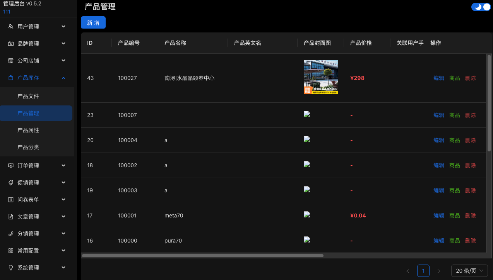

# 商城管理后台

> 基于 React + TypeScript + FarmJS 构建的现代化电商管理后台系统



## 特性

- **现代化构建** - 基于 FarmJS 的快速构建系统
- **组件化设计** - Ant Design 5.x + Panda CSS
- **主题切换** - 支持明暗主题无缝切换
- **权限管理** - 完整的 RBAC 权限控制系统
- **响应式布局** - 适配各种屏幕尺寸
- **地图集成** - 内置高德地图组件
- **富文本编辑** - 集成 wangEditor 编辑器
- **状态管理** - 基于 React Context 的状态管理
- **国际化支持** - 内置中文语言包
- **TypeScript** - 全面的类型安全保障

## 技术栈

### 核心技术
- **构建工具**: [FarmJS](https://farmfe.org/) - 极速构建系统
- **前端框架**: [React 18](https://reactjs.org/) + [TypeScript](https://www.typescriptlang.org/)
- **UI 组件库**: [Ant Design 5.x](https://ant.design/)
- **CSS 方案**: [Panda CSS](https://panda-css.com/) - 类型安全的 CSS-in-JS
- **路由管理**: [React Router 7](https://reactrouter.com/)
- **状态管理**: React Context API
- **HTTP 客户端**: [Axios](https://axios-http.com/)

## 项目结构

```
mall_web/
├── public/                 # 静态资源
├── src/
│   ├── assets/            # 项目资源文件
│   ├── common/            # 公共模块
│   │   ├── constants.ts   # 常量定义
│   │   ├── context.ts     # React Context
│   │   └── fetch.ts       # API 请求封装
│   ├── components/        # 通用组件
│   │   ├── Icons.tsx      # 自定义图标
│   │   ├── iconsList/     # 图标列表组件
│   │   ├── manage/        # 管理后台专用组件
│   │   └── panda/         # Panda CSS 组件
│   ├── hooks/             # 自定义 Hooks
│   │   └── useManaApi.tsx # API 调用 Hooks
│   ├── pages/             # 页面组件
│   │   ├── login/         # 登录页面
│   │   ├── manage/        # 管理后台
│   │   │   ├── system/    # 系统管理
│   │   │   ├── user/      # 用户管理
│   │   │   ├── mall*/     # 商城模块
│   │   │   ├── sales/     # 销售管理
│   │   │   └── article/   # 内容管理
│   │   └── not_found/     # 404 页面
│   ├── utils/             # 工具函数
│   ├── typings.d.ts       # 类型声明
│   ├── index.tsx          # 应用入口
│   └── main.tsx           # 主组件
├── styled-system/         # Panda CSS 生成文件
├── farm.config.ts         # FarmJS 配置
├── panda.config.ts        # Panda CSS 配置
├── tsconfig.json          # TypeScript 配置
└── package.json           # 项目配置
```

## 快速开始

### 环境要求

- Node.js >= 16.0.0
- npm >= 8.0.0 或 yarn >= 1.22.0

### 安装依赖

```bash
# 使用 npm
npm install

# 使用 yarn
yarn install

# 生成 Panda CSS 样式文件
npm run prepare
```

### 开发环境

```bash
# 1. 启动 Panda CSS 监听模式（第一个终端窗口）
npm run panda

# 2. 启动开发服务器（第二个终端窗口）
npm run dev
# 或者
npm start
```

应用将在 `http://localhost:3000` 启动

### 生产构建

```bash
# 构建生产版本
npm run build

# 预览构建结果
npm run preview

# 清理构建文件
npm run clean
```

## 功能模块

### 用户认证与权限
- **登录注册** - 支持用户名密码登录和注册
- **权限控制** - 基于角色的访问控制(RBAC)
- **Token 认证** - JWT Token 自动管理
- **会话管理** - 自动登录状态维护

### 商城管理
- **商品管理** - 商品增删改查、分类管理、属性配置
- **订单管理** - 订单列表、状态管理、物流跟踪
- **店铺管理** - 店铺信息、地理位置管理
- **品牌管理** - 品牌信息维护
- **库存管理** - 商品单位、属性管理

### 营销促销
- **优惠券系统** - 优惠券创建、条件设置、发放管理
- **促销活动** - 各类营销活动配置

### 用户管理
- **用户列表** - 用户信息查看和管理
- **角色管理** - 角色创建、权限分配
- **反馈管理** - 用户反馈收集和处理
- **认证管理** - 用户身份认证流程

### 数据统计
- **销售记录** - 销售数据统计和分析
- **业绩报表** - 销售员业绩管理

### 系统管理
- **权限配置** - 系统权限精细化控制
- **模块开关** - 功能模块开关管理
- **路径管理** - 系统路由配置
- **系统设置** - 各类系统参数配置

### 内容管理
- **文章管理** - 文章发布、分类管理
- **轮播管理** - 首页轮播图管理
- **表单管理** - 自定义表单创建和数据收集

## 主要特性

### 主题系统
- 支持明暗主题切换
- 主题状态持久化存储
- Ant Design 主题算法集成

### 文件上传
- 单文件/多文件上传支持
- 图片裁剪功能
- 文件分类管理
- 支持多种文件格式

### 地图功能
- 高德地图集成
- 地址选择组件
- 地理位置管理

### 富文本编辑
- 集成 wangEditor
- 支持图片上传
- 丰富的编辑功能

## 配置说明

### 环境配置

项目支持开发和生产环境的不同配置：

```typescript
// src/common/fetch.ts
export const CONFIG = {
  API_URL: process.env.NODE_ENV === "development"
    ? "http://localhost:3060"
    : "https://your-api-domain.com",
  BASE_NAME: process.env.NODE_ENV === "development" ? "" : "/mall",
  // ...其他配置
};
```

### Panda CSS 配置

```typescript
// panda.config.ts
export default defineConfig({
  preflight: true,
  jsxFramework: "react",
  include: ["./src/**/*.{js,jsx,ts,tsx}"],
  theme: {
    extend: {
      // 自定义主题配置
    },
  },
  outdir: "styled-system",
});
```
